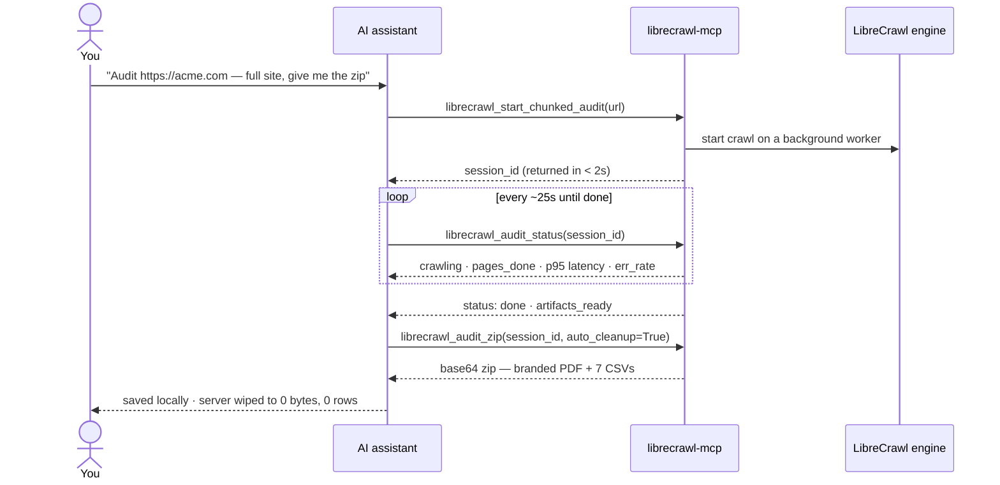
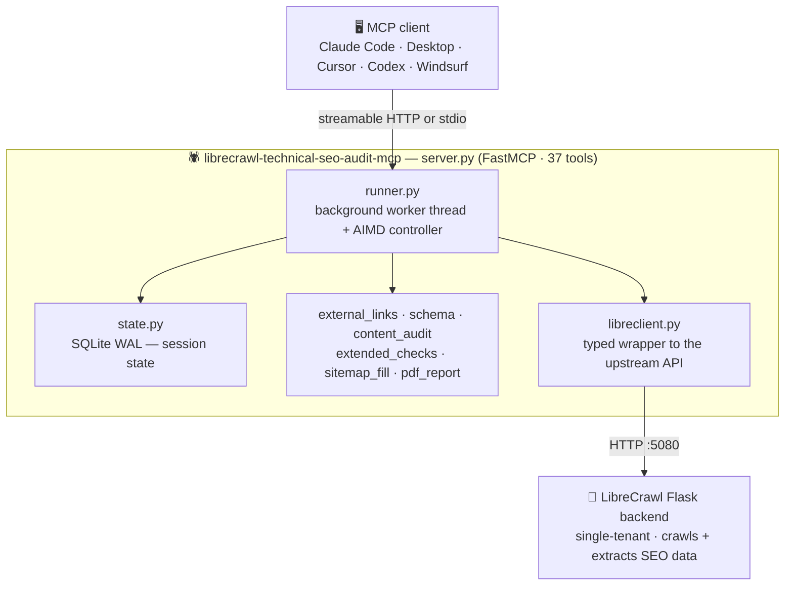

<!-- mcp-name: io.github.adityaarsharma/librecrawl-technical-seo-audit-mcp -->

<div align="center">

# 🕷️ librecrawl-technical-seo-audit-mcp

[](https://mcptoplist.com/server/pulsemcp%2Fadityaarsharma-librecrawl-seo)

### **The AI-native technical SEO crawler.**

Run a complete on-site SEO audit on any website — straight from Claude, Cursor, Codex, or any Model Context Protocol (MCP) client. **Unlimited pages · 50+ checks · PDF + CSVs · MIT-licensed · self-hosted · ephemeral by design.**

Built on the open-source [**LibreCrawl**](https://github.com/PhialsBasement/LibreCrawl) engine, exposed through 39 MCP tools your AI assistant calls directly.

[](LICENSE)
[](https://modelcontextprotocol.io)
[](https://python.org)
[](https://github.com/adityaarsharma/librecrawl-technical-seo-audit-mcp/releases)
[](https://github.com/adityaarsharma/librecrawl-technical-seo-audit-mcp/stargazers)
[](https://github.com/PhialsBasement/LibreCrawl)

[](https://docs.anthropic.com/claude-code)
[](https://claude.ai/download)
[](https://cursor.com)
[](https://github.com/openai/codex)
[](https://codeium.com/windsurf)
[](https://continue.dev)

**[⚡ Install in 60s](#-install-in-60-seconds) · [🪄 What it does](#-the-whole-pitch-in-4-lines) · [🚀 50+ checks](#-50-checks-every-audit) · [🆚 Compare](#-feature-comparison-to-other-on-site-seo-crawlers) · [📖 Quick start](#-your-first-audit)**

</div>

---

## 📑 Table of contents

- [What is an MCP?](#-dont-know-what-an-mcp-is-read-this-30-second-explainer)
- [The whole pitch in 4 lines](#-the-whole-pitch-in-4-lines)
- [One command = a complete audit](#-one-command--a-complete-audit-v220)
- [Why this exists](#-why-this-exists)
- [Install in 60 seconds](#-install-in-60-seconds) — [one-liner](#-install-in-60-seconds) · [Docker](#-run-the-full-stack-with-docker-recommended-for-self-hosting) · [manual](#-manual-install)
- [50+ checks every audit](#-50-checks-every-audit)
- [Feature comparison](#-feature-comparison-to-other-on-site-seo-crawlers)
- [What every audit produces](#-what-every-audit-produces)
- [Your first audit](#-your-first-audit)
- [How it works](#-how-it-works) · [Architecture](#-architecture)
- [Configuration](#-configuration)
- [39 MCP tools](#-39-mcp-tools)
- [Documentation](#-documentation)
- [Roadmap](#-roadmap)
- [License & credits](#-license--trademarks)

---

## 🤔 Don't know what an MCP is? Read this 30-second explainer

> **Model Context Protocol (MCP)** is the open standard that lets AI assistants like Claude, Cursor, or Codex call external tools. Think of it as "USB for AI assistants" — you plug a tool in, the AI can use it. librecrawl-technical-seo-audit-mcp is one of those tools. Once installed, you just *ask* your AI assistant to audit a site, and it does. No GUI. No dashboard. No exports.

**New to all this?**
- Don't have Claude Code yet? → [Install Claude Code](https://docs.anthropic.com/claude-code) (free for individuals).
- Prefer Cursor? → [Get Cursor](https://cursor.com).
- Already have one of those? → Skip to [Install in 60s](#-install-in-60-seconds).

---

## 🪄 The whole pitch in 4 lines

```
You:    Audit https://acme.com — full site, no caps, give me the zip
Agent:  → librecrawl_start_chunked_audit · polls until done · saves zip locally
You:    Show me broken pages + broken external links + hreflang errors
Agent:  → reads CSVs, prints filtered tables. Server already forgot the audit.
```

That's the product. **Your AI assistant runs a full technical SEO audit for you.** You get a branded PDF + 7 CSVs covering 50+ technical checks, ready to hand a client. The server wipes everything the moment you download.

---

## ✅ One command = a complete audit (v2.2.0)

No flags to remember, no caps to set. Anyone who runs:

```
librecrawl_start_chunked_audit(url="https://yoursite.com")
```

gets a **full end-to-end audit by default**:

- **Every page** — entire sitemap crawled, including orphan pages not linked from the homepage
- **Every page's text** — readability, AI-tells, boilerplate analyzed word-by-word
- **Every outbound link** — every domain (yours, third-party, social, CDN) HTTP-validated for broken links
- **No silent dropping** — per-page checks + link validation cover 100% of pages; the report states exactly what was covered
- **Heavy sites safe** — 4–5 MB pages crawl fine; Screaming-Frog-grade politeness never overloads the origin
- **Zero history** — the server forgets the entire audit the moment you download the zip; re-scan anytime, nothing persists

Verified on real production sites: 1,942-page and 709-page WordPress sites, full coverage, origins healthy throughout.

> **Note:** runs **one audit at a time** (single-tenant backend). For team use, queue audits sequentially — concurrent multi-audit routing is on the roadmap.

---

## 🔥 Why this exists

There are great desktop SEO crawlers (you know the ones). There are great cloud SEO suites. **There was no AI-native crawler.** librecrawl-technical-seo-audit-mcp fills that gap with five things no comparable open-source MCP server does:

### ⚡ It runs **inside your AI assistant**

39 MCP tools your agent calls directly. No GUI app to babysit, no SaaS dashboard to log into, no CSV exports to upload to ChatGPT. **You just ask.**

### 🚀 Chunked-progressive crawler that **never times out**

Most SEO MCP servers (SiteAudit MCP, AgentAEO, SE Ranking MCP) run synchronously and disconnect on sites over a few hundred pages. librecrawl-technical-seo-audit-mcp runs the crawl in a **background worker thread**, persists progress to SQLite WAL, and returns a `session_id` in **under 2 seconds**. Your agent polls a tiny status tool until done. **10,000-page enterprise sites work the same as 50-page blogs.** Survives PM2 / MCP-client restarts mid-crawl.

### 🛡️ Catches WAF challenges other crawlers **silently misreport**

Cloudflare, Akamai, DataDome, Imperva, and PerimeterX challenge pages are served as `200 OK` but contain a JavaScript challenge instead of your content. Most crawlers report these as "page OK, all good". librecrawl-technical-seo-audit-mcp fingerprints the challenge in the response body and flags `bot_block_challenge_detected`. **You see what's actually broken.**

### 🤖 An **AIMD controller** tunes crawl delay live

Additive-Increase / Multiplicative-Decrease — the same algorithm TCP congestion control uses. Error rate > 10% → halve chunk, double delay. p95 latency > 1.5× target → 1.5× delay. Clean signals → additive decrease. **Polite by construction. No rate-limit blow-ups. No manual tuning.** Respects `robots.txt` `Crawl-Delay` floor.

### 🧹 **Ephemeral by design** — the agency-safe default

Once you download the zip, the server deletes the session row, every artifact file on disk, AND the upstream LibreCrawl crawl record. **Per-audit server footprint after cleanup: 0 bytes, 0 rows.** Auditing 50 client sites? Zero data persists where another operator could see it.

### 📄 Branded **PDF reports** ready to hand a client

WeasyPrint, A4, page numbers, footer on every page. Open in any PDF viewer. No SaaS watermark. Hand it to a client as your work.

---

## ⚡ Install in 60 seconds

```bash
curl -fsSL https://raw.githubusercontent.com/adityaarsharma/librecrawl-technical-seo-audit-mcp/main/install.sh | bash
```

The installer asks 3 questions (target client, optional Google PageSpeed API key, optional GSC integration) and writes a ready-to-use MCP entry into your Claude / Cursor / Codex / Windsurf config. **Done.**

<details>
<summary><strong>What if I'm not a developer?</strong></summary>

You don't need to be. If you can:
1. Open a terminal (macOS: Cmd+Space → "Terminal" · Windows: Win+R → "powershell")
2. Paste the `curl` command above
3. Answer 3 yes/no questions

…you're done. The installer handles Python, Docker, the LibreCrawl backend, and your AI client config. **First-audit-to-zip is under 10 minutes from cold start.**

</details>

> **Three ways to run:** the **one-liner** above (guided installer) · **[Docker](#-run-the-full-stack-with-docker-recommended-for-self-hosting)** (full stack, one command — best for self-hosting/VPS) · **[manual](#-manual-install)** (Python venv + your own backend). New here? Start with the one-liner.

### 🐳 Run the full stack with Docker (recommended for self-hosting)

Brings up **both** the LibreCrawl engine and the MCP server, wired together and health-gated, with one command. Requires Docker + Docker Compose.

```bash
git clone https://github.com/adityaarsharma/librecrawl-technical-seo-audit-mcp.git
cd librecrawl-technical-seo-audit-mcp
docker compose up --build          # MCP at http://127.0.0.1:5081/mcp
```

The `mcp` service waits for LibreCrawl to report healthy before it starts. First build takes a few minutes (LibreCrawl pulls Chromium for JS rendering). Audit zips land in `./reports`. Full knobs in **[docs/CONFIGURATION.md](docs/CONFIGURATION.md)**.

Add to your client config (Claude Desktop / Code — HTTP transport):

```json
{
  "mcpServers": {
    "librecrawl": {
      "command": "npx",
      "args": ["-y", "mcp-remote", "http://127.0.0.1:5081/mcp"]
    }
  }
}
```

### 🔧 Manual install

Python 3.10+, plus a LibreCrawl backend (the Docker path above is the easiest way to get one).

```bash
git clone https://github.com/adityaarsharma/librecrawl-technical-seo-audit-mcp.git
cd librecrawl-technical-seo-audit-mcp
python3 -m venv venv && source venv/bin/activate
pip install -r requirements.txt
# Point the MCP at your running LibreCrawl backend, then start it:
LIBRECRAWL_URL=http://127.0.0.1:5080 python server.py
```

Add to your client config (Claude Desktop example):

```json
{
  "mcpServers": {
    "librecrawl": {
      "command": "npx",
      "args": ["-y", "mcp-remote", "http://127.0.0.1:5081/mcp"]
    }
  }
}
```

> Per-client setup (Claude Code, Cursor, Windsurf, Codex, Continue.dev) and every environment variable: **[docs/GETTING-STARTED.md](docs/GETTING-STARTED.md)** · **[docs/CONFIGURATION.md](docs/CONFIGURATION.md)**.

---

## 🚀 50+ checks every audit

<table>
<tr>
<td valign="top" width="50%">

#### 🔒 Security & headers
`missing_hsts` · `missing_csp` · `missing_x_frame_options` · `missing_x_content_type_options` · `missing_referrer_policy` · `x_robots_tag_vs_meta_mismatch` · `mixed_content`

#### 🛡️ WAF / bot-block detection
`bot_block_challenge_detected` — fingerprints **Cloudflare · Akamai · DataDome · Imperva · PerimeterX**

#### 🗺️ Sitemap & robots
`sitemap_url_noindex` · `sitemap_url_3xx` · `sitemap_url_disallowed_in_robots` · `sitemap_contains_canonicalized` · `sitemap_over_50k_urls` · `sitemap_over_50mb`

#### 🌍 Hreflang full audit
`missing_return_tag` · `missing_self_reference` · `missing_x_default` · `invalid_codes` · `to_noindex` · `to_broken` · `conflicts_lang_attr`

#### 🔗 Canonical health
`canonical_chain_depth` · `canonical_to_relative` · `canonical_to_redirect` · `canonical_outside_head` · `bad_canonical`

#### 🔁 Redirects (every flavour)
`redirect_chains` · `meta_refresh_redirect` · `js_redirect` · `http_refresh_redirect`

#### 🏷️ Schema.org (16 types)
Article · Product · Recipe · FAQPage · BreadcrumbList · Event · JobPosting · VideoObject · HowTo · Organization · LocalBusiness · Person · Review · AggregateRating · Course · NewsArticle — validates **schema.org spec** AND **Google Rich Results** required fields. Handles `@graph` (Yoast / Rank Math / WPRM).

</td>
<td valign="top" width="50%">

#### 🔤 URL quality
`url_contains_space` · `url_multiple_slashes` · `url_non_ascii` · `url_underscores` · `url_repetitive_path` · `long_urls` · `uppercase_urls` · `url_params_heavy`

#### ⚓ Anchor text
`non_descriptive_anchor_text` · `empty_anchor_text` · `anchor_image_no_alt` · `broken_bookmarks`

#### 🕸️ Internal linking
`internal_nofollow_outlinks` · `nofollow_only_inbound` · `follow_and_nofollow_mixed` · `orphan_pages`

#### 🖼️ Image performance + CLS
`lazy_load_attr_missing` · `srcset_missing` · `image_dimensions_missing` · `next_gen_image_format` · `image_oversized_kb` · `missing_alt_pages` · `broken_img_pages`

#### 📐 HTML structure
`html_over_2mb` · `noscript_in_head` · `broken_or_invalid_html` · `dom_size_excessive` · `lorem_ipsum_detected`

#### ♿ Accessibility / metadata
`iframes_present` · `iframe_missing_title` · `missing_favicon` · `missing_html_lang` · `invalid_html_lang` · `missing_charset` · `missing_viewport`

#### 🪤 Crawl-budget killers
`spider_trap_calendar` · `url_session_id_high_entropy` · `faceted_url_explosion`

#### ✍️ Content quality
`low_readability` (Flesch) · `long_sentences` · `passive_voice_pct` · `missing_terminal_punctuation` · `boilerplate_ratio` · `ai_tell_tokens_found` (delve · unlock · seamlessly · leverage) · `has_lorem_ipsum`

#### 🚨 Dev leaks
`outlinks_to_localhost` (RFC1918 in production)

</td>
</tr>
</table>

**🔗 Every outbound URL HEAD/GET-validated** into 17 status classes — `ok` · `redirect` · `forbidden` · `not_found` · `timeout` · `dns_error` · `ssl_error` · `connection_refused` · etc. Per-target: final URL after redirects, source pages, anchor text, response time, server header.

**📈 GSC merge** — pull Google Search Console data, call `librecrawl_merge_gsc_data(crawl_id, gsc_data)`. URLs normalised before joining. Emits **4 extra CSVs**: `per-page-with-gsc` · `gsc-winners` · `gsc-losers` (high impr + CTR <2%) · `gsc-quick-wins` (position 11–20 + impr ≥100).

---

## 🆚 Feature comparison to other on-site SEO crawlers

> This is a factual feature comparison. Prices were checked at publication and may have changed — see each vendor's site for current pricing. Brand names belong to their respective owners.

| Capability | Desktop crawler (Screaming Frog SEO Spider™)<sup>1</sup> | Desktop+cloud crawler (Sitebulb™)<sup>2</sup> | Cloud site-audit (Ahrefs™)<sup>3</sup> | **librecrawl-technical-seo-audit-mcp** |
|---|:---:|:---:|:---:|:---:|
| **Pricing model** | Free tier (500 URLs) · paid annual licence | Paid monthly subscription | Bundled with main subscription | **Free, MIT-licensed, self-hosted** |
| **Page cap** | 500 free / unlimited paid | Unlimited | Tiered by subscription plan | **♾️ Unlimited** |
| **Runs inside your AI assistant** | ❌ | ❌ | ❌ | ✅ |
| **Chunked / background crawl (no timeout)** | ❌ | ❌ | Cloud only | ✅ |
| **Auto-adaptive crawl delay (AIMD)** | ❌ | Manual | Hidden | ✅ |
| **WAF / bot-block detection on 200-OK pages** | ❌ | ❌ | ❌ | ✅ |
| **Sitemap-orphan fill (URLs not internally linked)** | ❌ | ❌ | ❌ | ✅ |
| **Ephemeral by default (zero server footprint)** | N/A | N/A | N/A | ✅ |
| Broken links (4xx/5xx/timeout/DNS/SSL) | ✅ | ✅ | ✅ | ✅ |
| Redirect chains with destination | ✅ | ✅ | ✅ | ✅ |
| Title / meta / H1 + duplicates | ✅ | ✅ | ✅ | ✅ |
| Canonical full audit | ✅ | ✅ | ✅ | ✅ |
| Hreflang full audit (incl. return-tag graph) | ✅ | ✅ | Partial | ✅ |
| Sitemap full cross-checks | ✅ | ✅ | Partial | ✅ |
| Schema.org validation (16 types + Rich Results) | ✅ | ✅ | Partial | ✅ |
| Soft-404 fingerprinting | ✅ | ✅ | ✅ | ✅ |
| Mixed content (HTTPS → HTTP) | ✅ | ✅ | ✅ | ✅ |
| Security headers pack | ✅ | ✅ | Partial | ✅ |
| Image performance + CLS | ✅ | ✅ | ✅ | ✅ |
| Content quality (Flesch · AI-tells · boilerplate) | ❌ | Partial | ❌ | ✅ |
| Crawl-budget traps (calendar · session-id · facets) | ✅ | ✅ | ✅ | ✅ |
| Branded PDF report | ❌ | ✅ | ❌ | ✅ |
| GSC clicks/impressions merge | Paid add-on | Paid add-on | Native | ✅ |
| JavaScript rendering | ✅ | ✅ | Cloud only | 🛣️ Roadmap |

<sub>
<sup>1</sup> Screaming Frog SEO Spider is a trademark of Screaming Frog Ltd, UK. We are not affiliated.<br>
<sup>2</sup> Sitebulb is a trademark of Sitebulb Ltd, UK. We are not affiliated.<br>
<sup>3</sup> Ahrefs is a trademark of Ahrefs Pte. Ltd., Singapore. We are not affiliated.
</sub>

**Reading guide:** if you currently use a paid on-site crawler and your workflow is *"crawl → export CSVs → analyse"*, librecrawl-technical-seo-audit-mcp covers that flow inside your AI assistant for £0 with no page caps. If your workflow depends on JavaScript-rendered SPAs, that's on the [roadmap](#-roadmap) but not shipped yet — use the desktop tool for now.

---

## 📊 What every audit produces

Single zip with 8 legacy files plus enabled V3 audit artifacts:

| File | Use |
|---|---|
| `SUMMARY.txt` | One-page orientation |
| `<domain>-<ts>.pdf` | **Branded human-readable PDF** (open in any viewer) |
| `<domain>-<ts>.md` | Markdown source of the PDF (grep-friendly) |
| `per-page.csv` | 1 row per URL × 30 columns of check booleans + `failed_checks_list` |
| `sitemap-recon.csv` | Sitemap-vs-crawl diff |
| `external-links.csv` | Every outbound URL + status |
| `content-audit.csv` | Per-page readability + AI-tells |
| `extended-checks.csv` | 1 row per (URL × check × severity × detail) — all 50+ checks |

---

## 📖 Your first audit

```text
You:   Audit https://example.com — full site, no caps

Agent: → librecrawl_start_chunked_audit(url=..., total_max_pages=10000)
         returns session_id in <2s

       → polls librecrawl_audit_status every 25s
         status: crawling, pages_done: 47,  current_delay_ms: 250
         status: crawling, pages_done: 312, last chunk p95: 480ms, err_rate: 0%
         status: done,     pages_done: 534, artifacts_ready: true

       → librecrawl_audit_zip(session_id, auto_cleanup=True)
         returns base64 zip (legacy + enabled V3 artifacts)
         SAVES LOCALLY as example.com-1780572742.zip
         Server wiped: session_rows=4, files=8, upstream_crawl=1

You:   Show me broken pages + broken external links

Agent: → unzips, reads per-page.csv (filters status_4xx OR status_5xx)
       → reads external-links.csv (filters not_found · forbidden · 5xx · timeout)
       → prints both tables
```

**Local zip is the only copy.** Server is back to zero state.

---

## 🛣️ Roadmap

| | Status |
|---|:---:|
| **JavaScript rendering** (Playwright headless, DOM diff vs raw HTML) — catches SPA / React / Next.js apps | 🟡 Designed |
| **Core Web Vitals from CrUX** — real-user 28-day field data, not just lab PSI | 🟡 Designed |
| **axe-core accessibility audit** — contrast, ARIA, focus order, alt-text quality | 🟡 Planned |
| **White-label PDF theming** (`--brand-config` for agencies) | 🟡 Planned |
| **Diff mode** — audit A vs audit B, "what regressed since last week?" | 🟡 Planned |
| **Webhook on completion** (Slack / Discord) — ping when long crawls finish | 🟡 Planned |

> **Not planned:** keyword research, backlink analysis, SERP tracking. Those are different problems with different MCP servers (DataForSEO, etc.). This tool is laser-focused on **technical on-site SEO crawling**.

[Open an issue](https://github.com/adityaarsharma/librecrawl-technical-seo-audit-mcp/issues/new) to bump priorities or request a check.

---

## 🔎 How it works

One audit, start to finished zip — every step is an MCP tool your agent calls:



---

## 🏗️ Architecture

Two processes: a thin MCP wrapper your agent talks to, and the LibreCrawl engine that does the crawling.



Full component walk-through: **[docs/ARCHITECTURE.md](docs/ARCHITECTURE.md)**.

---

## ⚙️ Configuration

All environment variables are optional — the defaults just work. Set them via your shell, `docker compose`, or your MCP client config.

| Env var | Default | Purpose |
|---|---|---|
| `LIBRECRAWL_URL` | `http://127.0.0.1:5080` | Full base URL of the LibreCrawl backend (Docker sets `http://librecrawl:5000`) |
| `LIBRECRAWL_PORT` | `5080` | Backend port (used only when `LIBRECRAWL_URL` is unset) |
| `MCP_HOST` | `127.0.0.1` | Bind address for HTTP transport (Docker sets `0.0.0.0`) |
| `MCP_PORT` | `5081` | MCP wrapper port |
| `MCP_TRANSPORT` | `http` | `http` (streamable) or `stdio` |
| `REPORTS_DIR` | `~/librecrawl-reports` | Where audit zips land |
| `AUDIT_SNAPSHOT_BASELINE_PATH` | unset | Optional Rule 74 baseline (`audit-snapshot-v1.json.gz`) |
| `AUDIT_SNAPSHOT_OUTPUT_DIR` | `REPORTS_DIR` | Persistent directory for current snapshots and crawl diffs |
| `LIBRECRAWL_UPSTREAM_DB` | `~/.librecrawl/upstream/users.db` | LibreCrawl's SQLite, for orphan/cleanup checks (degrades gracefully if absent) |
| `PAGESPEED_API_KEY` | unset | Optional — enables `librecrawl_pagespeed*` (raises PSI limits) |
| `GSC_ACCESS_TOKEN` | unset | Optional OAuth 2.0 token for V3 Search Console evidence |
| `GSC_SITE_URL` | unset | Exact URL-prefix or `sc-domain:` Search Console property |

📖 Full reference, per-client config, and transport details: **[docs/CONFIGURATION.md](docs/CONFIGURATION.md)**.

---

## 🛠️ 39 MCP tools

<details>
<summary><strong>Expand the full tool reference</strong></summary>

**Chunked audit (95% of work):**
- `librecrawl_start_chunked_audit` · `librecrawl_audit_status` · `librecrawl_audit_zip`
- `librecrawl_audit_pause` · `librecrawl_audit_resume` · `librecrawl_audit_cancel` · `librecrawl_audit_force_advance`
- `librecrawl_audit_artifacts` · `librecrawl_audit_pdf` · `librecrawl_report_content`
- `librecrawl_master_audit_status` · `librecrawl_snapshot_diff`

**Specialist:**
- `librecrawl_external_links_audit` — re-run external-link validation on a specific crawl
- `librecrawl_schema_validate` · `librecrawl_schema_check` · `librecrawl_schema_audit`
- `librecrawl_merge_gsc_data` · `librecrawl_append_gsc_section` — Google Search Console data merge
- `librecrawl_pagespeed` · `librecrawl_pagespeed_audit` · `librecrawl_pagespeed_audit_all_crawl_pages` — PageSpeed Insights
- `librecrawl_site_check` — instant site-level check
- `librecrawl_internal_links_analysis` · `librecrawl_filter_issues` · `librecrawl_visualization_data`

**Maintenance:**
- `librecrawl_wipe_everything` — nuclear reset to zero
- `librecrawl_brain_purge_audit` — purge a single audit

**Legacy (kept for backwards compat, avoid for big sites):**
- `librecrawl_audit` · `librecrawl_full_audit_strict` · `librecrawl_generate_report` · `librecrawl_export_results` · `librecrawl_get_status` · `librecrawl_get_settings` · `librecrawl_list_crawls` · `librecrawl_start_crawl` · `librecrawl_stop_crawl` · `librecrawl_pause_crawl` · `librecrawl_resume_crawl` · `librecrawl_resume_from_crawl_id`

</details>

---

## 📚 Documentation

Deeper guides live in [`docs/`](docs/):

| Guide | What's inside |
|---|---|
| **[Getting Started](docs/GETTING-STARTED.md)** | Install every way (one-liner · Docker · manual), per-client config for Claude Code/Desktop, Cursor, Windsurf, Codex, Continue.dev, and your first audit end-to-end |
| **[Configuration](docs/CONFIGURATION.md)** | Every environment variable, HTTP vs stdio transport, ports, reports directory, PageSpeed key |
| **[Tools Reference](docs/TOOLS.md)** | All 39 MCP tools — signatures, arguments, when to use each |
| **[Architecture](docs/ARCHITECTURE.md)** | How the wrapper, background worker, AIMD controller, and LibreCrawl backend fit together |
| **[Troubleshooting](docs/TROUBLESHOOTING.md)** | Common errors and fixes — backend unreachable, empty audits, PDF/WeasyPrint, Docker health, big-site tuning |
| **[Snapshot Diff](docs/audit/SNAPSHOT_DIFF.md)** | Portable crawl snapshots, Rule 74 baseline workflow, schema, and failure semantics |

---

## 📜 License & trademarks

**Code: MIT.** Use it on client work, agency work, internal tools, anything. No attribution required (but appreciated). See [LICENSE](LICENSE).

**Trademarks.** All third-party product names mentioned in this README (including any names referenced in the comparison table) are property of their respective owners. This project is not affiliated with, endorsed by, or sponsored by any third-party tool vendor. Comparisons are based on publicly available information at the time of writing and exist for the purpose of informing readers evaluating different categories of SEO tooling.

---

## 🙏 Credits

- **[LibreCrawl](https://github.com/PhialsBasement/LibreCrawl)** — the upstream open-source crawler this MCP server wraps. MIT. **Please go star them — this project would not exist without that work.**
- **[Anthropic Model Context Protocol](https://modelcontextprotocol.io)** — the protocol this server speaks
- **[WeasyPrint](https://weasyprint.org/)** — Markdown → HTML → PDF rendering
- **[FastMCP](https://github.com/jlowin/fastmcp)** — the Python MCP server framework

---

<div align="center">

### Built by [Aditya Sharma](https://adityaarsharma.com) · MIT · No telemetry · No SaaS · No vendor lock-in

</div>

---

<sub>

**Discoverability keywords:** seo audit mcp server · open-source seo crawler · self-hosted seo crawler · technical seo audit mcp · on-site seo audit tool · alternative to paid seo crawlers · free seo audit tool · seo crawler for claude · seo crawler for cursor · seo crawler for openai codex · seo crawler for windsurf · seo crawler for continue.dev · mcp server for seo · model context protocol seo · hreflang audit tool free · canonical chain checker · broken link checker unlimited · core web vitals audit cli · structured data validator command line · schema.org rich results validator · sitemap audit tool · sitemap orphan detection · WAF detection crawler · cloudflare challenge detector · security headers checker · CSP HSTS audit · google search console integration crawler · soft 404 detection · chunked crawler no timeout MCP · technical SEO audit api · python seo crawler · seo agency tool open source · ephemeral seo audit · agency-safe seo crawler · branded pdf seo report · seo audit cli tool · mit-licensed seo crawler · free site audit tool · enterprise seo crawler self-hosted · librecrawl mcp · librecrawl mcp server

</sub>
