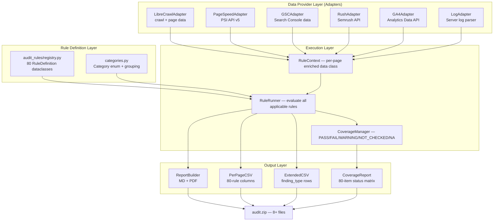

# Master Audit Architecture — 80-Item Enterprise SEO Audit Standard

> **Status**: Phase 1 Analysis | **Date**: 2026-08-09  
> **Target**: `librecrawl-technical-seo-audit-mcp` v2.2.0 → v3.0.0  
> **Author**: System analysis — awaiting human approval before implementation

---

## 1. Executive Summary

### 1.1 Current State (v2.2.0)

The codebase implements **50+ technical SEO checks** across 3 independent evaluation layers with no shared rule registry:

| Layer | Location | Check Count | Scope |
|-------|----------|:-----------:|-------|
| Inline report builder | `server.py:_build_report()` | ~30 checks | Per-page boolean conditions + site-level checks |
| Checks manifest | `server.py:_build_checks_manifest()` | 37 named checks | Pass/fail census across all pages |
| Per-page CSV lambdas | `server.py:_PER_PAGE_CHECKS` | 21 lambda predicates | Bool columns per URL |
| Extended checks | `extended_checks.py:run_extended_checks()` | ~45 check_name values | Security, hreflang, canonical, crawl traps, URL quality, HTML structure |
| Content audit | `content_audit.py:audit_content()` | 9 threshold-based flags | Readability, AI tells, boilerplate |
| Schema validator | `schema_validator.py:validate_crawl_schemas()` | 7 check_name values | Schema.org + Google Rich Results required fields |
| External links | `external_links.py:audit_external_links()` | 17 status classes | Per-outbound-URL validation |

### 1.2 Target State (v3.0.0)

A **Unified Audit Rule Registry** that:
- Defines all 80 rules in a single machine-readable data structure
- Executes each rule via a common `RuleRunner` using the PageContext pattern
- Produces coverage reports for all 80 items with PASS/FAIL/WARNING/NOT_CHECKED/NOT_APPLICABLE statuses
- Integrates external data providers through a pluggable adapter pattern
- Generates the existing 8-file zip + new artifacts without breaking backward compatibility

### 1.3 Capability Gap Summary

| Classification | Count | Definition |
|---|---|---|
| **EXISTING_FULL** | 18 (22.5%) | Fully implemented, matches 80-item spec |
| **EXISTING_PARTIAL** | 24 (30.0%) | Partially implemented, needs enhancement |
| **NEW_AUTO** | 9 (11.25%) | Automatable with new code, no external deps |
| **NEW_EXTERNAL_DATA** | 17 (21.25%) | Needs external API/access (GSC, PSI, Semrush, GA4, Server Logs) |
| **NEW_MANUAL** | 12 (15.0%) | Requires human review, can't be fully automated |
| **TOTAL** | **80 (100%)** | — |

---

## 2. Current Architecture Deep-Dive

### 2.1 Check Execution: Three Fragmented Layers

The current system evaluates SEO rules in three completely separate passes over the same page data, with no shared rule definition or single source of truth:

```
                    ┌─────────────────────────┐
                    │   LibreCrawl Export      │
                    │   pages[dict] + links[]  │
                    └───────────┬─────────────┘
                                │
            ┌───────────────────┼───────────────────┐
            ▼                   ▼                   ▼
    ┌───────────────┐   ┌───────────────┐   ┌───────────────┐
    │ _build_report │   │ _build_checks │   │ _write_per_   │
    │ (MD output)   │   │ _manifest()   │   │ page_csv()    │
    │               │   │               │   │               │
    │ ~30 inline    │   │ 37-item       │   │ 21 lambda     │
    │ conditions    │   │ inventory     │   │ predicates    │
    │ DUPLICATED    │   │ DUPLICATED    │   │ DUPLICATED    │
    └───────────────┘   └───────────────┘   └───────────────┘
```

**Problem**: Adding a new rule requires editing 3+ locations with identical logic. Severity is inconsistent — some rules use implicit structural placement (Critical vs Warnings section), others use hardcoded `"high"/"medium"/"low"` strings, and 12 content-audit flags use binary thresholds with no severity at all.

### 2.2 Page Data Flow

```mermaid
flowchart LR
    A[LibreCrawl Upstream] -->|HTTP export| B[_parse_export]
    B -->|pages: list[dict]| C{sitemap_fill}
    C -->|merged pages| D[external_links]
    C -->|merged pages| E[_build_report]
    C -->|merged pages| F[content_audit]
    C -->|merged pages| G[extended_checks]
    C -->|merged pages| H[schema_validator]
    C -->|merged pages| I[_write_per_page_csv]
    E -->|markdown| J[pdf_report]
```

**Problem**: Every module receives the full `pages` list and independently re-filters, re-normalizes, and re-fetches data. Content audit and extended checks each fetch pages a second time via HTTP (one per URL), which doubles network load during finalize.

### 2.3 Severity Model Fragmentation

| Module | Severity Model |
|--------|---------------|
| `_build_report()` | Implicit: Critical → Warnings → Informational sections |
| `checks_manifest` | No severity — pass/fail counts only |
| `extended_checks` | Hardcoded `"high"`/`"medium"`/`"low"` per check group |
| `schema_validator` | Hardcoded `"high"`/`"medium"` per check |
| `content_audit` | No severity — threshold-based binary flag |
| `external_links` | No per-link severity — `broken_classes` set for summary counting |

**Problem**: No unified severity taxonomy. The same finding can be "Critical" in the MD report, absent from the manifest, and "high" in extended_checks.

### 2.4 External Data Integrations (Current)

| Source | Integration Point | Auto-Wired? |
|--------|------------------|-------------|
| Google PageSpeed Insights | 3 MCP tools (single/batch/all-crawl) | ❌ Not in chunked audit pipeline |
| Google Search Console | `librecrawl_merge_gsc_data` (parameter-fed) | ❌ External MCP server required |
| Semrush | None | ❌ |
| GA4 | None | ❌ |
| Server Logs | None | ❌ |
| WordPress Admin | None | ❌ |
| LibreCrawl upstream SQLite | Cleanup only (`DELETE FROM`) | ✅ |

---

## 3. Target Architecture: Unified Audit Rule Registry

### 3.1 Core Design Principles

1. **Single Source of Truth**: Every rule is defined in exactly one place — `audit_rules/registry.py`
2. **PageContext Pattern**: Each page's data is fetched once, enriched once, and evaluated by all applicable rules
3. **Pluggable Data Providers**: External integrations (PSI, GSC, Semrush) are adapters behind a common interface
4. **Unified Severity Taxonomy**: All 80 rules use the same well-defined severity levels
5. **Backward Compatible**: Existing APIs, CSV formats, and zip structure are preserved; new fields are additive
6. **Offline-First Testing**: Every automated rule is testable with HTML fixtures — no live internet required in CI

### 3.2 Component Diagram



### 3.3 RuleDefinition Schema (Core Data Contract)

```python
@dataclass
class RuleDefinition:
    # Identity
    id: int                          # 1–80, matches Master Checklist
    check_name: str                  # Machine-readable, e.g. "robots_txt_exists"
    category: Category               # Enum: CRAWL_INDEX, URL_REDIRECT, SITE_ARCH, etc.
    
    # Human-readable metadata
    title: str                       # e.g. "robots.txt 存在与规则"
    description: str                 # Detailed description in Chinese + English
    priority: Priority               # Enum: P0_CRITICAL, P1_HIGH, P2_MEDIUM, P3_LOW
    
    # Execution
    detection_method: DetectionMethod # Enum: STATIC_ANALYSIS, HTTP_FETCH, EXTERNAL_API, MANUAL_REVIEW, COMPOSITE
    data_sources: list[DataSource]   # What data this rule needs
    rule_function: Callable | None   # The check function (None for NEW_MANUAL)
    
    # Acceptance
    acceptance_criteria: str         # What "pass" looks like
    finding_type: FindingType        # Enum: ERROR, WARNING, OPPORTUNITY
    seo_impact: str                  # Brief description of SEO consequence
    
    # Governance
    owner: str                       # SEO / Dev / Content / Infra / Analytics / Security
    remediation: str                 # How to fix
    tools: str                       # Tools that can detect this
    notes: str                       # Caveats, edge cases
    
    # Implementation status
    impl_status: ImplStatus          # EXISTING_FULL / EXISTING_PARTIAL / NEW_AUTO / NEW_EXTERNAL / NEW_MANUAL
    external_provider: str | None    # "pagespeed" / "gsc" / "semrush" / "ga4" / "server_logs" / None
```

### 3.4 PageContext Pattern

Instead of each check independently filtering pages and making HTTP calls, the `PageContext` enriches each page once:

```python
@dataclass
class PageContext:
    # === LIGHTWEIGHT FIELDS (retained across all pages for cross-page analysis) ===
    url: str
    status_code: int
    title: str | None
    meta_description: str | None
    h1: str | None
    canonical_url: str | None
    robots: str | None
    word_count: int
    response_time_ms: int
    depth: int
    content_hash: str | None          # minhash for near-duplicate detection
    lang: str | None
    images: list[dict] | None         # Summary only (count, broken_count, missing_alt_count)
    hreflang: list[dict] | None       # Summary only
    json_ld: list[dict] | None        # Summary only (@type list)
    og_tags: dict | None
    viewport: str | None
    links_detailed: list[dict] | None # Link graph references (url, anchor, is_internal, rel)
    
    # === HEAVY FIELDS (lazy-loaded, bounded cache, released after page-level evaluation) ===
    # These should NEVER be pre-populated for all pages.
    # They are fetched on demand (from existing crawl export data in Phase 1),
    # evaluated against page-scoped rules, then released.
    _body_html: str | None            # Full HTML — lazy, released after rules complete
    _body_text: str | None            # Stripped text — lazy, released after rules complete
    _response_headers: dict | None    # HTTP response headers — lazy, released
    
    # === External data (lazy-loaded per page, not pre-fetched; None = not available) ===
    pagespeed_data: dict | None       # From PageSpeedAdapter (Phase 3+)
    gsc_data: dict | None             # From GSCAdapter (Phase 5+)
```

**Memory strategy**: The lightweight fields (~2 KB per page) are retained for all pages to support cross-page analysis (dup detection, orphan detection, etc.). Heavy fields (~5 MB per page on large sites) are loaded individually from existing crawl export data, evaluated, and released. At no point does the system hold full HTML for more than `max_concurrent_heavy_pages` pages (default: 1).

### 3.5 ExecutionStatus vs ResultStatus — Two-Axis Coverage Model

Coverage evaluation uses two independent axes:

| Axis | Enum | Values | Meaning |
|------|------|--------|---------|
| **ExecutionStatus** | `ExecutionStatus` | `EXECUTED_FULL`, `EXECUTED_PARTIAL`, `NOT_CHECKED`, `NOT_APPLICABLE` | *Was the rule executed?* |
| **ResultStatus** | `ResultStatus` | `PASS`, `FAIL`, `WARNING`, `OPPORTUNITY`, `INTENTIONAL`, `UNKNOWN` | *What was the outcome?* |

Key semantics:
- **Sampled rules** (20/300 pages): `EXECUTED_PARTIAL` even if all 20 samples pass
- **Missing external data**: `NOT_CHECKED` + `UNKNOWN` — never `PASS` or `FAIL`
- **Manual-only rules**: `NOT_CHECKED` + `UNKNOWN` — never automated `PASS`
- **WordPress rule on generic site**: `NOT_APPLICABLE` with reason

### 3.6 RuleRunner: Single-Pass Evaluation

```python
class RuleRunner:
    def __init__(self, registry: RuleRegistry, data_providers: dict[str, DataProvider]):
        self.registry = registry
        self.providers = data_providers
    
    def evaluate_site(self, site_check_data: dict, sitemap_data: dict, 
                      robots_data: dict) -> list[Finding]:
        """Evaluate site-scoped rules (robots.txt, sitemap, domain, HTTPS)."""
    
    def evaluate_page(self, ctx: PageContext) -> list[Finding]:
        """Evaluate all page-scoped rules against a single PageContext."""
    
    def evaluate_cross_page(self, all_contexts: list[PageContext], 
                            links: list[dict]) -> list[Finding]:
        """Evaluate rules requiring cross-page analysis (duplicates, orphans, chains)."""
    
    def coverage_report(self) -> CoverageMatrix:
        """Generate 80-row PASS/FAIL/WARNING/NOT_CHECKED/NA matrix."""
```

### 3.6 DataProvider Adapter Interface

```python
class DataProvider(ABC):
    """Pluggable external data source."""
    
    @abstractmethod
    def name(self) -> str: ...
    
    @abstractmethod
    def is_available(self) -> bool: ...
    
    @abstractmethod
    async def enrich_contexts(self, contexts: list[PageContext], 
                              config: dict) -> None: ...
    
    def missing_rules(self) -> list[int]:
        """Which rule IDs require this provider but can't run without it."""
```

Concrete adapters:
- `LibreCrawlDataProvider` — always available (core crawl data)
- `PageSpeedDataProvider` — requires `PAGESPEED_API_KEY`
- `GSCDataProvider` — requires GSC data feed (from `gsc-posi` MCP or direct API)
- `SemrushDataProvider` — requires Semrush API key
- `GA4DataProvider` — requires GA4 property access
- `ServerLogDataProvider` — requires log file path/access

---

## 4. File Layout — Recommended Directory Structure

```
librecrawl-technical-seo-audit-mcp/
│
├── server.py                          # MCP tool surface (modified: registry integration)
├── runner.py                          # Background worker (modified: RuleRunner integration)
├── state.py                           # SQLite state (unmodified in Phase 1)
├── libreclient.py                     # Upstream wrapper (unchanged)
│
├── audit_rules/                       # ★ NEW: Unified Rule Registry
│   ├── __init__.py
│   ├── registry.py                    # 80 RuleDefinition instances
│   ├── categories.py                  # Category + Priority + FindingType enums
│   ├── severity.py                    # Unified severity taxonomy
│   ├── runner.py                      # RuleRunner + CoverageManager
│   ├── context.py                     # PageContext + SiteContext dataclasses
│   └── providers/                     # DataProvider adapters
│       ├── __init__.py
│       ├── base.py                    # DataProvider ABC
│       ├── librecrawl_provider.py     # Core crawl data (always available)
│       ├── pagespeed_provider.py      # Google PageSpeed Insights
│       ├── gsc_provider.py            # Google Search Console
│       ├── semrush_provider.py        # Semrush API
│       ├── ga4_provider.py            # Google Analytics 4
│       └── server_log_provider.py     # Server log analysis
│
├── checks/                            # ★ REFACTORED: checks organized by category
│   ├── __init__.py
│   ├── crawl_index.py                 # Rules 1–5: robots.txt, sitemap, noindex, 4xx/5xx, crawl budget
│   ├── url_redirect.py                # Rules 6–8, 49–51: domain, redirects, canonical, URL normalization
│   ├── site_architecture.py           # Rules 9–12: depth, breadcrumbs, internal links, faceted nav
│   ├── content_metadata.py            # Rules 13–18, 52–56: titles, meta, H1, thin/duplicate content
│   ├── technical_performance.py       # Rules 19–23, 61–63: CWV, TTFB, render-blocking, images, cache
│   ├── mobile_ux.py                   # Rule 24: mobile usability
│   ├── security_headers.py            # Rules 25–26, 39, 67: HTTPS, HSTS, CSP, XML-RPC, staging
│   ├── structured_data.py             # Rules 27–28, 78: schema coverage, conflicts, content match
│   ├── international.py               # Rules 29, 58–60: hreflang, language detection
│   ├── link_analysis.py               # Rules 30–31, 77: broken links, backlinks, link quality
│   ├── js_seo.py                      # Rules 46–48: rendered content, crawlable links, lazy-load
│   ├── wordpress.py                   # Rules 32, 36–39, 64–69: WP-specific checks
│   ├── trust_eeat.py                  # Rule 57: E-E-A-T trust signals
│   ├── monitoring.py                  # Rules 34–35, 72–73, 80: GSC/GA4 config, manual actions, change log, uptime
│   └── conversion.py                  # Rules 70–71, 74: form accessibility, E2E testing, regression
│
├── content_audit.py                   # Refactored to use PageContext + Registry
├── extended_checks.py                 # Refactored — rules migrated to checks/*.py
├── schema_validator.py                # Refactored to use Registry
├── external_links.py                  # Refactored to use Registry
├── sitemap_fill.py                    # Unchanged (data acquisition, not rule execution)
├── pdf_report.py                      # Enhanced with coverage summary
│
├── audit_specs/                       # Specification files
│   ├── technical_seo_master_checklist_80.csv   # Source of truth (existing)
│   └── master_audit_mapping.csv                # ★ NEW: 80-row mapping to implementation
│
├── docs/
│   └── audit/
│       ├── MASTER_AUDIT_ARCHITECTURE.md   # This file
│       ├── MASTER_AUDIT_MAPPING.md        # Detailed per-rule gap analysis
│       └── IMPLEMENTATION_PLAN.md         # 8-phase roadmap
│
├── tests/                              # ★ NEW: Test fixtures + unit tests
│   ├── fixtures/
│   │   ├── html/                       # HTML snippets per check scenario
│   │   ├── pages/                      # Full page exports (mock LibreCrawl responses)
│   │   └── sitemaps/                   # Sample sitemap.xml files
│   ├── test_registry.py                # Registry integrity tests
│   ├── test_runner.py                  # RuleRunner evaluation tests
│   ├── test_providers.py               # DataProvider adapter tests
│   └── test_coverage.py                # Coverage matrix generation tests
```

---

## 5. Artifact Changes — What the Zip Contains (v3.0.0)

| # | File | v2.2.0 | v3.0.0 | Change |
|---|------|:------:|:------:|--------|
| 1 | `SUMMARY.txt` | ✅ | ✅ | Enhanced with 80-rule coverage summary |
| 2 | `{domain}-{ts}.md` | ✅ | ✅ | New sections for added categories |
| 3 | `{domain}-{ts}.pdf` | ✅ | ✅ | Rendered from updated MD |
| 4 | `{domain}-{ts}.per-page.csv` | ✅ 21 cols | ✅ 80+ cols | One column per automated rule |
| 5 | `{domain}-{ts}.sitemap-recon.csv` | ✅ | ✅ | Unchanged |
| 6 | `{domain}-{ts}.external-links.csv` | ✅ | ✅ | Unchanged format |
| 7 | `{domain}-{ts}.content-audit.csv` | ✅ | ✅ | Unchanged format |
| 8 | `{domain}-{ts}.extended-checks.csv` | ✅ | ✅ | Now includes all 80 rule findings |
| 9 | `{domain}-{ts}.coverage.csv` | ❌ | ✅ ★ NEW | 80-row PASS/FAIL/WARNING/NA/NOT_CHECKED |
| 10 | `{domain}-{ts}.master-audit-meta.json` | ❌ | 🔮 Phase 7 | Audit metadata placeholder (no fabricated score) |

---

## 6. Backward Compatibility Strategy

### 6.1 MCP Tool API
All 37 existing MCP tool signatures are **preserved**. New tools added with `librecrawl_` prefix:
- `librecrawl_coverage_report(session_id)` — returns 80-rule coverage matrix
- `librecrawl_external_provider_status()` — which data providers are configured
- *(Audit Score deferred to Phase 7 — no `audit-score.json` in Phase 1)*

### 6.2 CSV Format
Existing CSV columns are preserved. New columns are **appended** to the right — any downstream script reading by column name is unaffected. Scripts reading by column index should use the coverage CSV which is a new file.

### 6.3 Zip Structure
Existing filenames and internal paths are unchanged. Two new files are added. The `SUMMARY.txt` listing gains new entries but keeps the same format.

### 6.4 Database Schema
`state.py` tables (`sessions`, `chunks`, `artifacts`, `events`) are preserved. **Phase 1 does not modify `state.py`.** No new database tables are added. Coverage data is produced as a CSV file on disk, not stored in SQLite.
*(Audit scoring tables deferred to Phase 7.)*

---

## 7. Summary Statistics

| Metric | v2.2.0 | v3.0.0 Target |
|--------|:------:|:-------------:|
| Automated rules (Phase 1) | ~55 (fragmented) | 18 (EXISTING_FULL bindings) |
| Automated rules (end state) | ~55 (fragmented) | 68 target |
| Rules with unified severity | 0 | 80 |
| Rules with test coverage | 0 | 18 (EXISTING_FULL) in Phase 1 |
| Page fetches per audit (Phase 1) | 2× (crawl + checks re-fetch) | **0 extra** (uses existing export data; no re-fetch) |
| Single source of truth | ❌ | ✅ (`audit_rules/registry.py` loaded from CSV) |
| Coverage report | ❌ | ✅ (80-row coverage.csv; ExecutionStatus + ResultStatus split) |
| Offline-testable | ❌ | ✅ (HTML fixtures for all automated rules) |

---

## 8. Risk Register — Top 5 Technical Risks

| # | Risk | Likelihood | Impact | Mitigation |
|---|------|:----------:|:------:|------------|
| 1 | **Registry migration breaks existing checks** — moving rule logic from inline conditionals to registry-backed functions introduces regression risk | Medium | **High** | Run v2.2.0 vs v3.0.0 side-by-side on 3 known domains; diff all CSV outputs; require 100% match on EXISTING_FULL rules before accepting |
| 2 | **PageContext memory pressure** — caching full HTML bodies for all pages could OOM on large sites | Medium | **High** | Lazy/bounded/streaming strategy: heavy fields (body_html, body_text) loaded on demand and released after page-level rule evaluation; only lightweight fields (url, status, title, canonical, etc.) retained across pages for cross-page analysis; no artificial page cap on crawl size |
| 3 | **External API rate limits** — PageSpeed API has 400 requests/min quota; Semrush has monthly limits | Medium | **Medium** | Configurable batch delay; sample strategy for large sites; report `NOT_CHECKED` for rate-limited URLs rather than failing |
| 4 | **Circular import hell** — 15 new modules in `checks/` + `audit_rules/` risk import cycles with `server.py` ↔ `runner.py` | Medium | **High** | All rule functions are pure functions imported by registry; registry has zero imports from server/runner; runner imports registry (one-way) |
| 5 | **Dual-audit-path maintenance** — supporting both inline `_build_report` checks AND registry-backed checks during transition | High | **Medium** | Phase out the old inline checks module-by-module (8 phases); each phase independently verifiable; old code removed only after phase acceptance |
